# Singh_Shobhit_CPRE5450_Project — Mermaid Diagrams

Project: **Fault-Tolerant Multimodal Presence Verification and Safe Activation Policies on ESP32-S3 Using mmWave Radar and Vision**

Use these Mermaid diagrams directly in PowerPoint by exporting them as SVG/PNG from Mermaid Live Editor, VS Code Mermaid Preview, or Markdown Preview Mermaid Support.

---

## Diagram 1 — Project Scope Mapping
**Use on Slide 1 or Slide 2: Title and Scope**

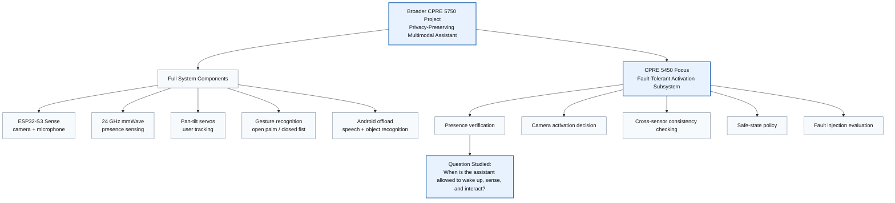

---

## Diagram 2 — Fault-Tolerant Systems Framing
**Use on Slide 3: Problem Statement and Failure Modes**

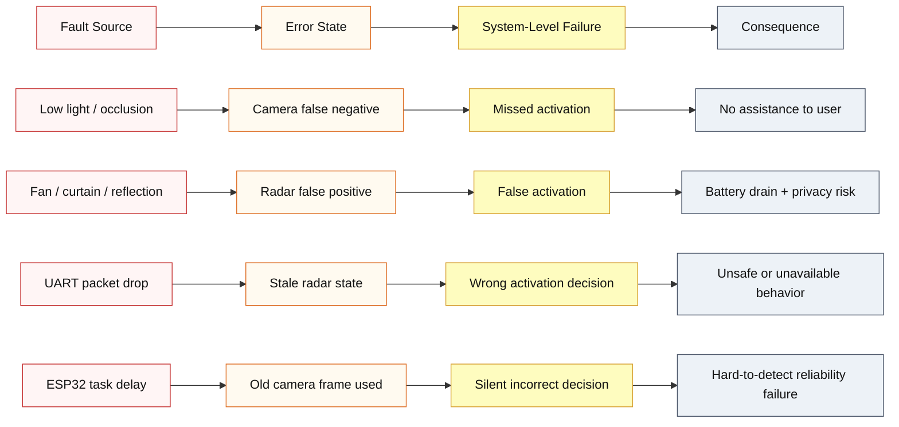

---

## Diagram 3 — End-to-End Data Flow of the Larger System
**Use on Slide 2 or Slide 4: Application Context**

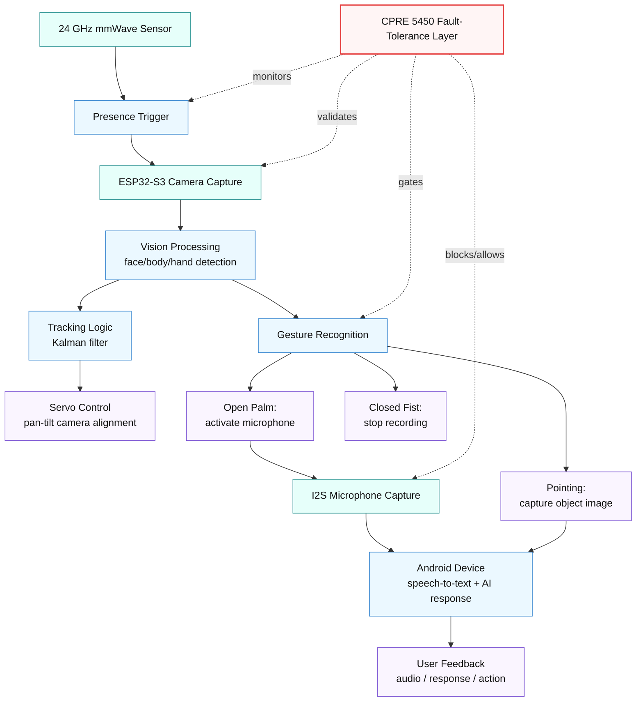

---

## Diagram 4 — Proposed Fault-Tolerant Architecture
**Use on Slide 10: Proposed Architecture**

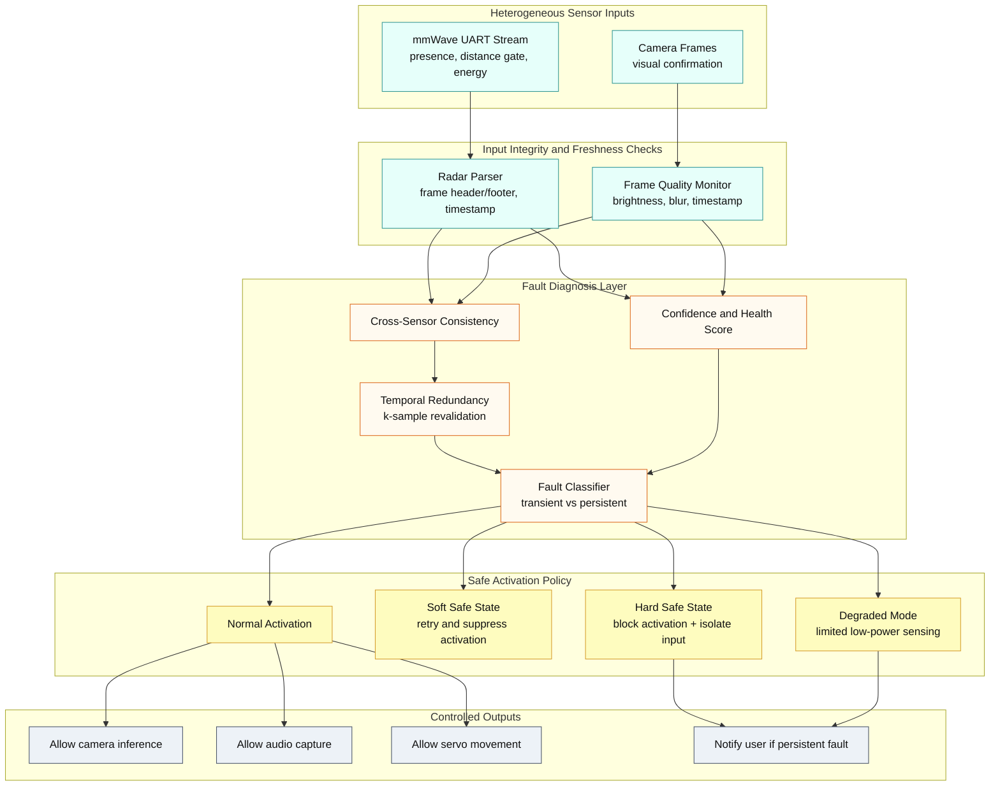

---

## Diagram 5 — Runtime Sequence: Normal Activation vs Fault Handling
**Use on Slide 10 or Slide 12**

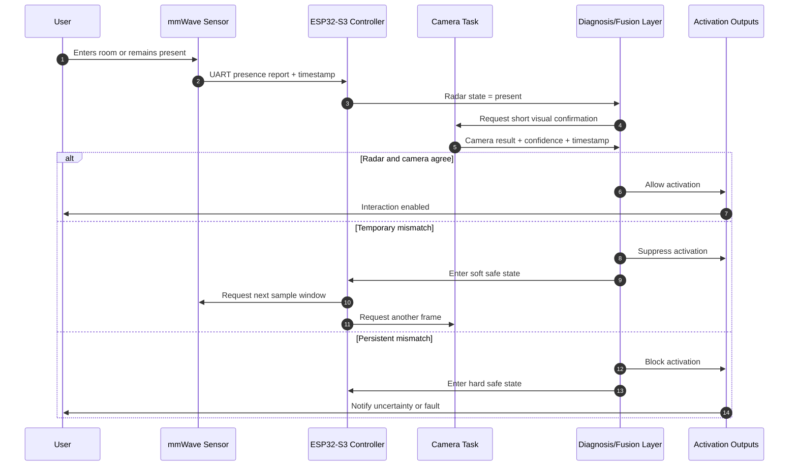

---

## Diagram 6 — Diagnosis Decision Logic
**Use on Slide 11: Fault Model and Diagnosis Logic**

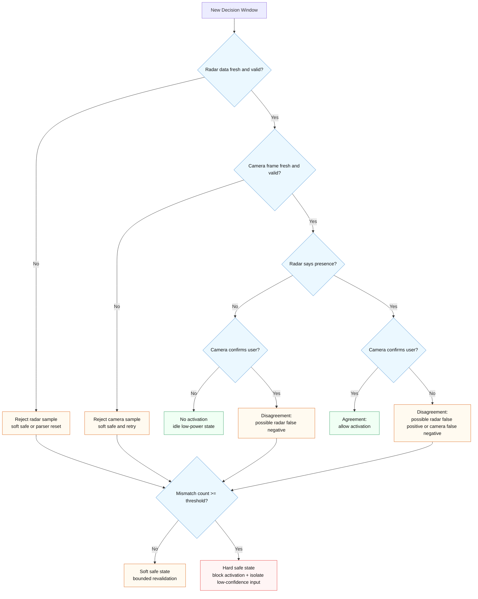

---

## Diagram 7 — Activation State Machine
**Use on Slide 12: Safe-State and Recovery Policy**

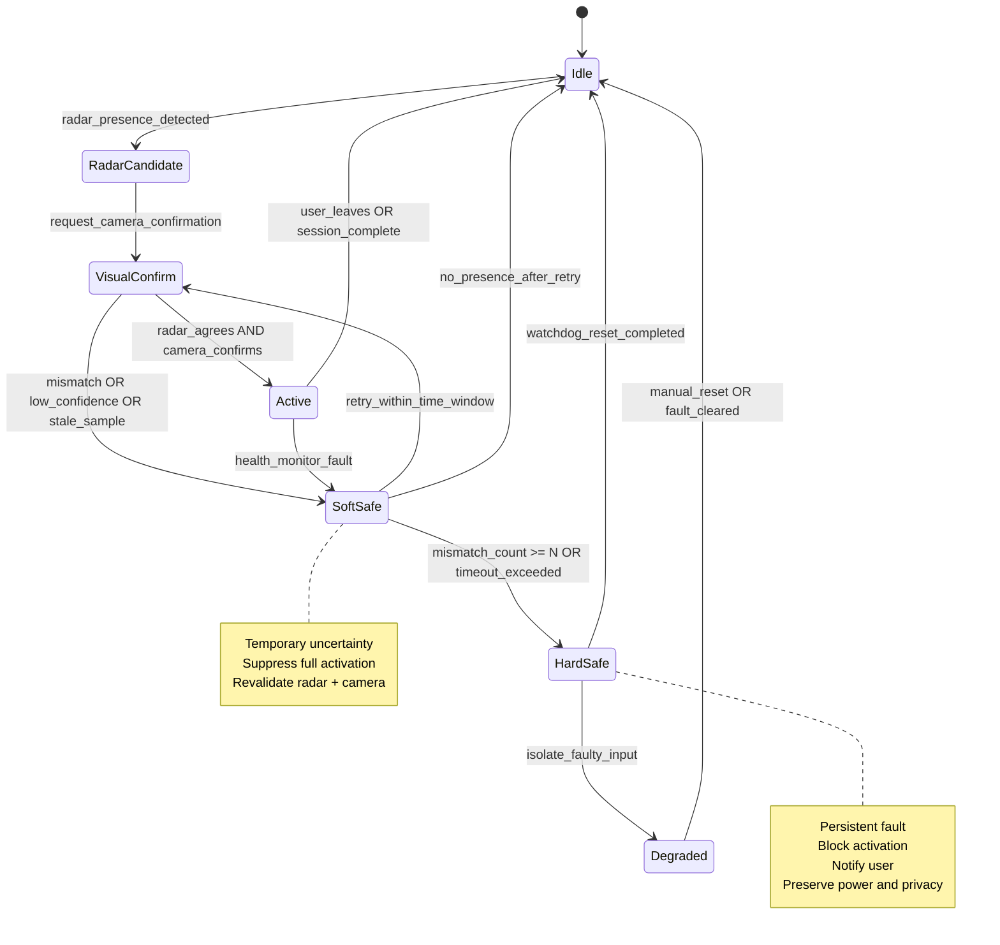

---

## Diagram 8 — Fault Taxonomy for the Activation Subsystem
**Use on Slide 11: Fault Model**

```mermaid
flowchart TD
    F["Faults in Activation Subsystem"]

    F --> S["Sensor Faults"]
    S --> S1["Camera false negative<br/>low light, blur, occlusion"]
    S --> S2["Camera false positive<br/>background mistaken as user"]
    S --> S3["Radar false positive<br/>fan, curtain, reflections"]
    S --> S4["Radar false negative<br/>range-gate or orientation issue"]

    F --> T["Transport and Data Faults"]
    T --> T1["UART packet drop"]
    T --> T2["Radar framing error"]
    T --> T3["Stale timestamp"]
    T --> T4["Queue overflow"]

    F --> C["Computation and Timing Faults"]
    C --> C1["Camera task deadline miss"]
    C --> C2["Fusion task delay"]
    C --> C3["Watchdog event"]
    C --> C4["Memory pressure / frame loss"]

    F --> E["Environment / OOD Faults"]
    E --> E1["Low light"]
    E --> E2["Reflective surfaces"]
    E --> E3["Moving clutter"]
    E --> E4["Unexpected human posture"]

    F --> P["Policy-Level Failures"]
    P --> P1["False activation"]
    P --> P2["Missed activation"]
    P --> P3["Unsafe privacy-sensitive sensing"]

    classDef root fill:#e8f2ff,stroke:#2b6cb0,stroke-width:2px,color:#111;
    classDef category fill:#fffaf0,stroke:#dd6b20,stroke-width:2px,color:#111;
    classDef leaf fill:#f7fafc,stroke:#718096,color:#111;
    class F root;
    class S,T,C,E,P category;
    class S1,S2,S3,S4,T1,T2,T3,T4,C1,C2,C3,C4,E1,E2,E3,E4,P1,P2,P3 leaf;
```

---

## Diagram 9 — Recovery Block Model for Visual Confirmation
**Use on Slide 12: Recovery Policy / Known Approaches**

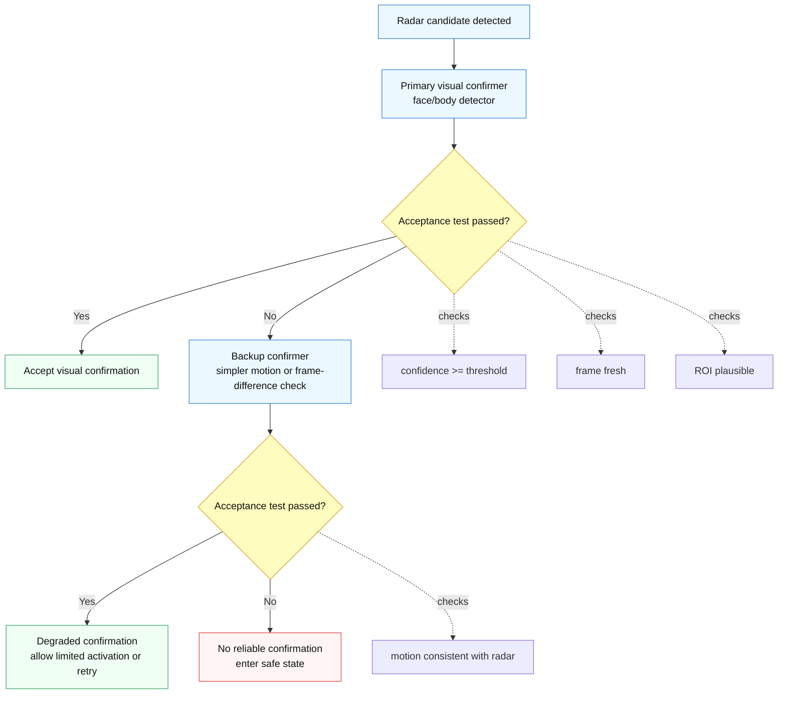

---

## Diagram 10 — Health-Aware Confidence Fusion Model
**Use on Slide 8 or Slide 14**

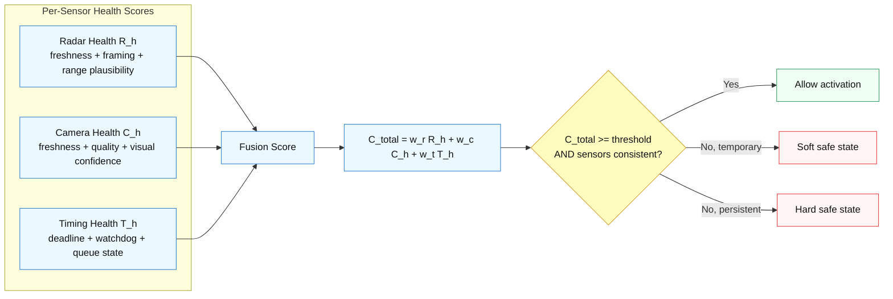

---

## Diagram 11 — ESP32-S3 FreeRTOS Task Model
**Use on Slide 4 or Slide 10**

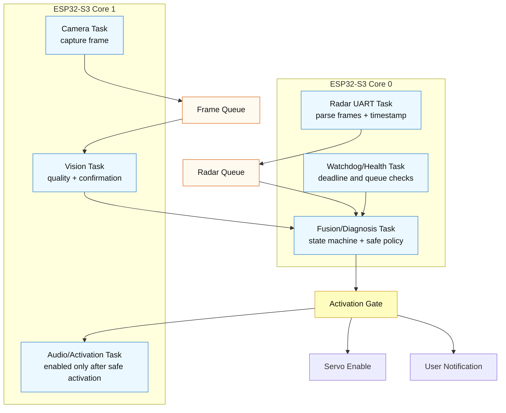

---

## Diagram 12 — Fault Injection and Evaluation Workflow
**Use on Slide 13: Evaluation Plan**

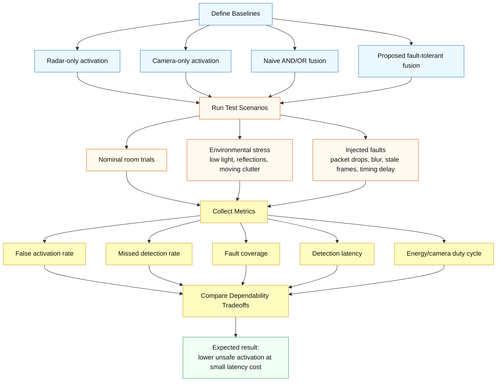

---

## Diagram 13 — Baseline vs Proposed Solution Comparison
**Use on Slide 14: Analysis of Existing Solutions**

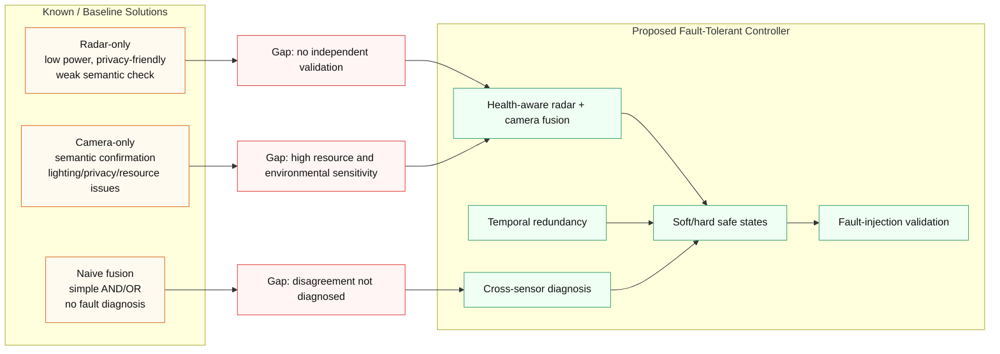

---

## Diagram 14 — Conservative Activation Policy Model
**Use on Slide 15: Expected Contribution**

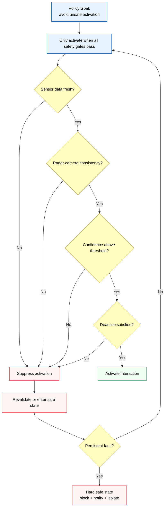

---

## Diagram 15 — Final Report Logic Model
**Use on conclusion slide or backup slide**

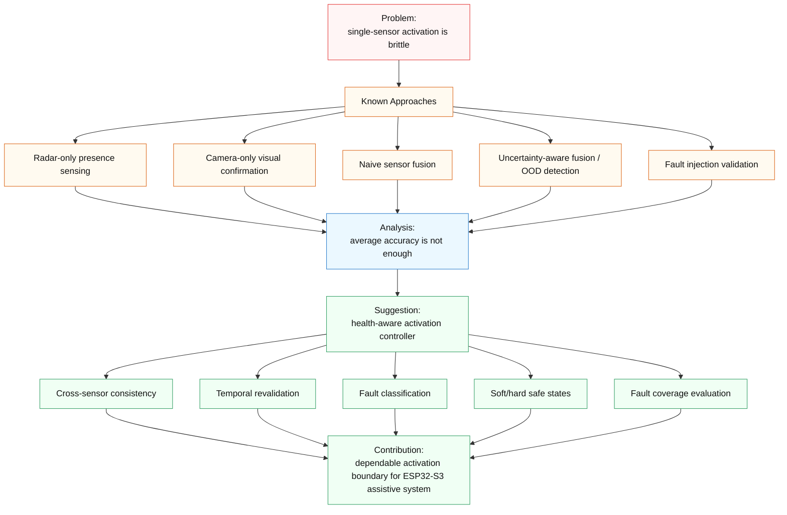

---

## Suggested Slide Mapping Summary

| Slide | Recommended Diagram |
|---|---|
| Slide 1–2 | Diagram 1: Project Scope Mapping |
| Slide 3 | Diagram 2: Fault-Tolerant Systems Framing |
| Slide 4 | Diagram 3 or Diagram 11 |
| Slide 5–7 | Diagram 13: Baseline vs Proposed Comparison |
| Slide 8 | Diagram 10: Confidence Fusion Model |
| Slide 9 | Diagram 12: Fault Injection Workflow |
| Slide 10 | Diagram 4: Proposed Architecture |
| Slide 11 | Diagram 8 or Diagram 6 |
| Slide 12 | Diagram 7 or Diagram 9 |
| Slide 13 | Diagram 12 |
| Slide 14 | Diagram 13 |
| Slide 15 | Diagram 14 or Diagram 15 |

